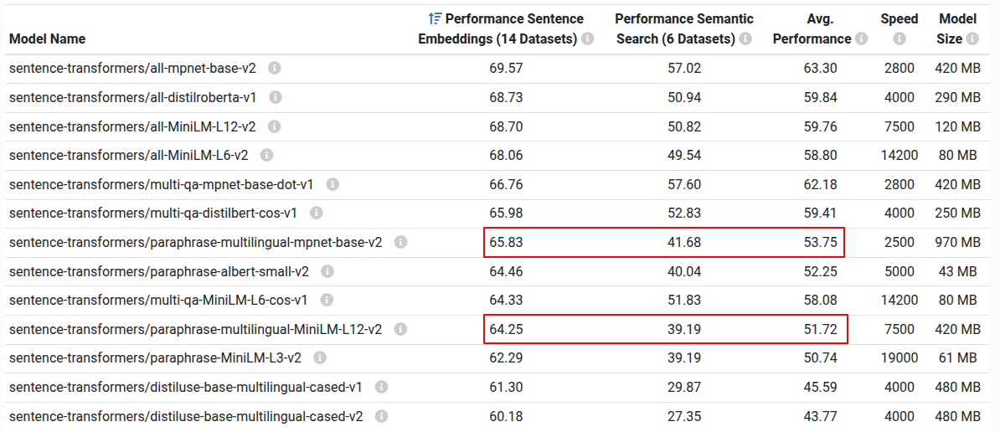

# Desafio Técnico — Estágio em Ciência de Dados
**FGV IBRE — Instituto Brasileiro de Economia**

---

## Contexto

O FGV IBRE produz indicadores econômicos de referência para o Brasil — como o IGP-M, o IPC e o ICC — e publica dezenas de notas técnicas por mês. Nesse volume de produção textual, a capacidade de **buscar e recuperar informação relevante** de forma eficiente é cada vez mais valiosa.

Neste desafio, você vai construir um **mini motor de busca semântico** aplicado a notícias econômicas. O objetivo não é implementar um sistema de produção, mas demonstrar que você sabe limpar dados textuais, aplicar modelos de linguagem e raciocinar sobre similaridade semântica.

---

## Visão Geral

O desafio está dividido em **três etapas encadeadas**:

```
noticias_brutas.json  →  [Etapa 1: Limpeza]  →  dados_limpos
                                                         ↓
                                               [Etapa 2: Embeddings]
                                                         ↓
                                               [Etapa 3: Busca Semântica]
```

## Etapa 1: Limpeza de Dados

A primeira etapa é transformar o arquivo `noticias_brutas.json` em um formato mais limpo e estruturado. O meu primeiro passo foi dar uma investigada geral no arquivo  original de dados brutos. A princípio, o arquivo parecia conter uma lista de dicionários e não havia muitas notícias lixo (curtas) ou duplicatas. O campo de texto estava com diversos caracteres, tags HTML, metadados e formatações que não eram relevantes para a análise.

O arquivo de limpeza `clean_data.py` recebe o arquivo bruto, processa cada notícia e salva um novo arquivo `noticias_limpas.json` com as seguintes transformações:

- **Remoção de espaços extras e quebras de linha**: garante que o texto fique mais uniforme, eliminando múltiplos espaços e quebras de linha desnecessárias.

- **Limpeza de tags HTML**: `clean_html_tags` usa uma função da biblioteca BeautifulSoup para extrair apenas o texto de uma sentença, removendo quaisquer tags HTML presentes.

- **Limpeza de palavras<sup>1</sup>**: remove palavras irrelevantes que geralmente estão presentes nos metadados da notícia e que não agregam valor semântico. Após uma verificação manual dos dados, identifiquei palavras como "Publicado em" no início do texto.

- **Limpeza de datas<sup>1</sup>**: `clean_per_date` remove a data de publicação do texto principal, constantemente presente quando no corpo do texto há os metadados.

- **Limpeza de caracteres especiais**: remove caracteres como `-`, `|` e `—` que podem estar presentes no texto, mas não contribuem para a análise semântica. Necessário inserir espaços entre os caracteres para evitar remoção de palavras com hífen.

- **Limpeza de fonte<sup>1</sup>**: `clear_source_on_start` remove a fonte de onde foi tirada a notícia do início do texto, caso esteja presente, para evitar que informações de fonte sejam confundidas com o conteúdo da notícia.

- **Limpeza de Hora<sup>1</sup>**: remove a hora de publicação do texto principal, constantemente presente quando no corpo do texto há os metadados.

<sup>1</sup>Esses processos de limpeza podem apresentar um risco ao remover palavras/informações que sejam parte do texto, mas para esse conjunto de dados pequeno, a ocorrência dessas situações é apenas em metadados. Para um conjunto de dados maior, seria interessante criar uma função mais robusta para identificar e remover metadados.

**Obs.1** : A etapa de limpeza pode ser realizado de forma independente do processo principal do programa.

**Obs.2** : Ao executar esse script, o arquivo `noticias_limpas.json` será criado na pasta `dados/`.

**Obs.3** : A execução do script `clean_data.py` gera uma pasta `logs/`, a cada processo de limpeza será criado um arquivo de log com o nome `cleaning_log_{data_e_hora}.txt`, onde serão registradas informações sobre o processo de limpeza.

## Etapa 2 e 3: Geração de Embeddings e Busca Semântica

As etapas 2 e 3 estão integradas no script `exec_embeddings.py`. A geração de embeddings é um processo que transforma um documento de texto ou uma sentença em um vetor numérico, o que é mais fácil de ser processado por algoritmos, já que o computador não precisa analisar semanticamente o texto, mas sim comparar números.

Já a busca semântica é um processo que utiliza os embeddings para encontrar documentos ou sentenças que sejam semanticamente semelhantes a uma query (sentença curta). A ideia é comparar os vetores de embeddings dos documentos com o vetor de embeddings da consulta e retornar os documentos mais próximos. O processo que de busca que iremos implementar é a `Asymetric Semantic Search`, já que temos uma query curta e um documento longo.

Olhando a documentação da biblioteca `sentence-transformers`, existem diversos modelos pré-treinados que podem ser utilizados para gerar embeddings. Entretanto a maioria dos modelos pré-treinados são em inglês, os modelos que lidam com textos em português são chamados de "multilingual".



Como ambos os dois modelos que lidam com textos em português possuem performance similar pela tabela, optei por utilizar os dois modelos: `sentence-transformers/paraphrase-multilingual-MiniLM-L12-v2` e `sentence-transformers/paraphrase-multilingual-mpnet-base-v2`, no final, irei comparar os resultados de ambos os modelos para verificar se há diferenças significativas na busca semântica e selecionar o modelo que apresentou melhor performance (o que eu selecionaria para utilizar em um cenário real). Vale mencionar também que o modelo mpnet-base-v2 possui quase que o dobro de tamanho comparado ao modelo MiniLM-L12-v2, convém comparar os resultados para verificar se o aumento de performance justifica o aumento de espaço ocupado.

O script `exec_embeddings.py` tem a seguinte estrutura:
- **Carregamento dos dados limpos**: O script começa carregando o arquivo `noticias_limpas.json` gerado na etapa de limpeza.
- **Geração de embeddings**: Para cada notícia limpa, o script gera um vetor de embeddings utilizando os modelos pré-treinados selecionados. 
- **Busca semântica**: Após a geração dos embeddings, o script implementa a função a busca semântica, que recebe uma query e retorna as notícias mais relevantes com base na similaridade semântica entre os embeddings da query e os embeddings das notícias. Por padrão, a loss_function utilizada para calcular a similaridade é a `cosine_similarity`.
- **Resultados**: Os resultados da busca semântica são salvos em um arquivo `result.json` na pasta `results/`, onde cada query é associada às notícias mais relevantes encontradas.

O script `show_results.py` é um script auxiliar que tem a função de exibir os resultados da busca semântica de forma mais legível, lendo o arquivo `result.json` e imprimindo as notícias mais relevantes para cada query. No script é implementado uma biblioteca que permite configurar o que é exibido para cada resultado a partir de flags. No manual de reprodução, irá conter as flags utilizadas para exibir os resultados da busca semântica.

**Obs.1** : A etapa de geração de embeddings e busca semântica estão integradas, mas podem ser realizadas de forma independente do processo principal do programa, desde que exista o arquivo `noticias_limpas.json` gerado na etapa de limpeza.

**Obs.2** : A execução do script `show_results.py` exibe os resultados da busca semântica no terminal e pode ser executada também desacoplada do processo principal, desde que exista o arquivo `result.json` gerado na etapa de busca semântica.

## Análise dos Resultados

### Notícias relevantes e querys
Deixando um pouco de lado uma análise de número (olhar os scores gerados) e fazendo uma análise mais humana das notícias que foram classificadas mais relevantes, os modelos se sairam muito bem achando as notícias que se encaixam nos assuntos da query.

### Sobre os modelos
O modelo `sentence-transformers/paraphrase-multilingual-mpnet-base-v2` apresentou uma performance melhor na busca semântica, apresentando notícias mais relevantes para as queries em comparação com o modelo `sentence-transformers/paraphrase-multilingual-MiniLM-L12-v2`. O modelo mpnet-base-v2 conseguiu capturar melhor as nuances semânticas das notícias, o que resultou em uma busca mais precisa. Por exemplo, lendo as notícias como um leitor, a notícia para a query "mudanças de taxas de juros" que possui maior relação é a de ID 11, a qual aborda mudança na taxa Selic. O modelo mpnet-base-v2 conseguiu identificar essa relação, enquanto o modelo MiniLM-L12-v2 não conseguiu identificar essa relação tão claramente, apresentando notícias menos relevantes para a query. Apesar do aumento de espaço ocupado pelo modelo mpnet-base-v2, a melhoria na performance justifica a escolha desse modelo para a geração de embeddings.


### Uso do título da matéria no início do corpo do texto.
Adicionar o título no início do texto (atuando como um mini-resumo), não causou um impacto tão significante ao resultado obtido. Os modelos apenas com as informações da matéria completa selecionavam notícias que realmente tinham a ver com o assunto da query. Por exemplo, para a query "inflação e preços ao consumidor" com o modelo mpnet, as notícias que tem mais compatibilidade não mudaram com o adicional do título ou não. Além disso, informações que são muito compatíveis com a query geralmente não sentem a diferença com a informação adicional, para a mesma query sobre inflação mas para o modelo miniLM, as notícias de ID 2 e 9 realmente abordam bastante sobre o assunto da query e por isso ambas ficam no topo do ranking.

## Manual de Reprodução

1. Clone o repositório e navegue até a pasta do projeto:
```bash
git clone https://github.com/Mthhs1/fgv-ibre-test.git
cd fgv-ibre-test
```
2. Necessário ter o Python instalado. Caso tenha as bibliotecas necessárias instaladas o programa deve funcionar sem problemas, entretanto, caso queira criar um ambiente virtual e instalar as dependências, siga os passos abaixo:
```bash
python -m venv venv
source venv/bin/activate  # Linux/Mac
venv\Scripts\activate  # Windows
pip install -r requirements.txt
```
3. Execute o script principal do repositório. Esse script irá realizar o pipeline completo, desde a limpeza dos dados, geração de embeddings e busca semântica. O resultado da busca semântica será salvo no arquivo `result.json` na pasta `results/`, um resumo dos resultados da busca semântica será exibido no terminal e os logs do processo de limpeza serão salvos na pasta `logs/`.
```bash
python src/main.py
```
ou
```bash
python3 src/main.py
```
4. Também é possível executar cada etapa de forma independente, caso queira realizar apenas a limpeza dos dados, geração de embeddings e busca semântica, ou exibir os resultados da busca semântica. Para isso, utilize os seguintes comandos:
```bash
python src/clean_data.py  # Etapa de limpeza de dados
python src/exec_embeddings.py  # Etapa de geração de embeddings e busca semântica
python src/show_results.py  # Exibir os resultados da busca semântica
```

Para os scripts `exec_embeddings.py` e `show_results.py`, é necessário ter antes o arquivo `noticias_limpas.json` gerado na etapa de limpeza, e para o script `show_results.py`, é necessário ter o arquivo `result.json` gerado na etapa de busca semântica.

5. O script `show_results.py` possui flags para configurar o que é exibido para cada resultado da busca semântica. As flags disponíveis são (ou execute `python src/show_results.py --help` para ver as opções):
```bash
--model {mpnet, miniLM}  # Filtra o modelo utilizado para a busca semântica (mpnet ou miniLM)
--mode {com_titulo, sem_titulo}  # Configura se o título da notícia deve ser exibido ou não
--top_k N  # Configura o número de notícias mais relevantes a serem exibidas para cada query (padrão: 5)
--diff  # Exibe a diferença de notícias no ranqueamento entre os dois modelos (apenas para comparação)
```

Exemplos:
```bash
python src/show_results.py --model mpnet 
python src/show_results.py --model miniLM --mode sem_titulo --top_k 3
python src/show_results.py --diff
python src/show_results.py --mode com_titulo
```